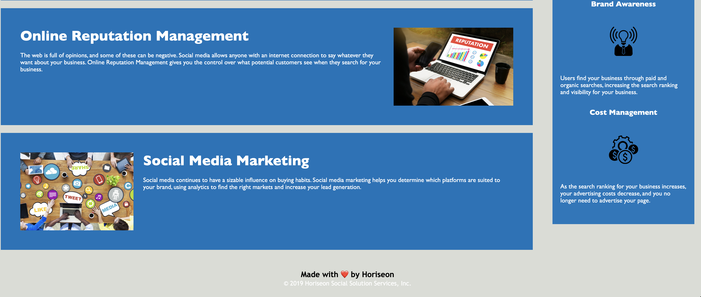

Horiseon website updated for Accessibility

In this repository, please find revised files, which should meet the client's acceptance criteria. I have satisfied the requests of the client in the following manner...
• Accessibility improved page-wide
• divs replaced with semantic HTML elements.
• Elements follow a logical structure.
• Icon and image elements have also been enhanced with accessiblity attributes.
• Heading attributes fall in sequential order, matching positions of those sections on the page.
• The title element is now more descriptive.

• Static screenshots can be found in the assets folder of this repository: https://github.com/KPL33/Horiseon-Accessibility

